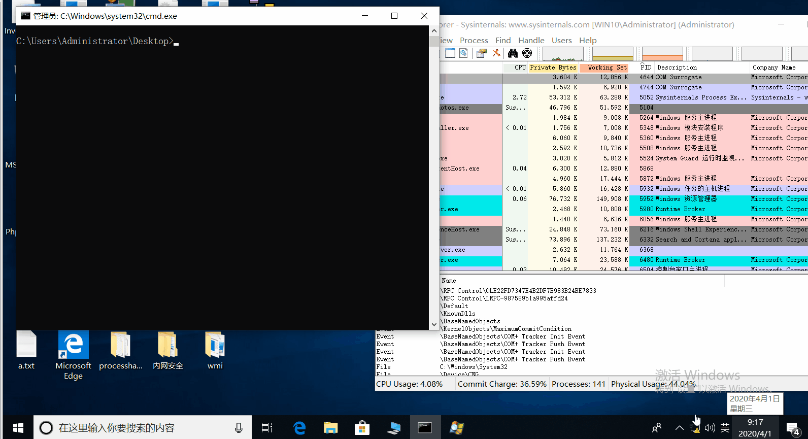

# EventLogBypass

Terminate the thread of the log service to disable the system log function, but the log service is still running

## Usage

You can run the following command to get the `PID` of the corresponding process svchost.exe of eventlog service

```
powershell -c "Get-WmiObject -Class win32_service -Filter \"name = 'eventlog'\" | select -exp ProcessId"
```

```
EventLogBypass.exe pid
```



## Restore Eventlog Service


```
taskkill /F /pid pid && net start eventlog
```

## Reference

Learn from 3gstudent's blog

[https://github.com/3gstudent/Windows-EventLog-Bypass](https://github.com/3gstudent/Windows-EventLog-Bypass)